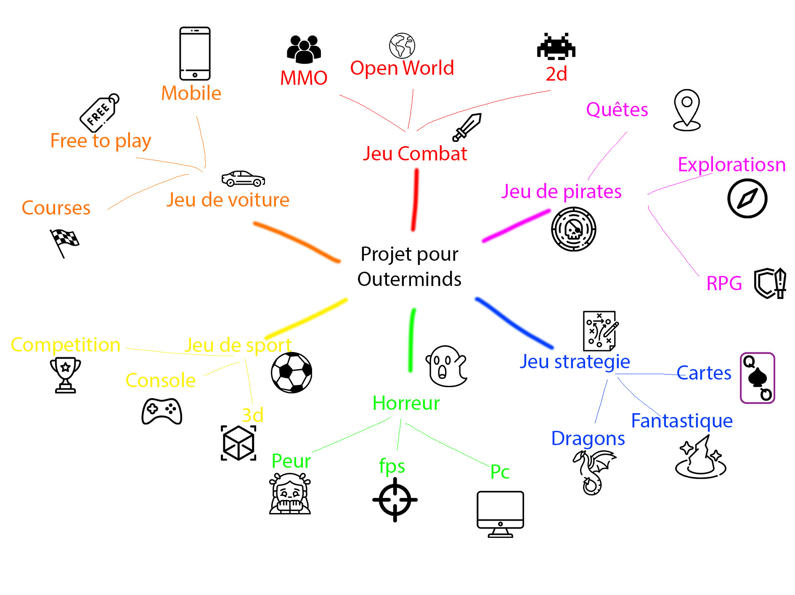

# Cours 14
## Plan de la présentation 3
Durée: 8 à 10 minutes

### Résumer votre projet en une phrase
Nous avons pensé à créer un jeu open world et multi-joueur dans un monde de style pixel !

### Description du projet 
 Un jeux open world, de bataille, avec un sytle pixel, free to play et finalement un RPG.

### Schéma du projet ou scénarimage

 
### Moodboard

### Technologies
Décrivez quelles seront les technologies utilisées dans votre projet. 

### Tâches
-Programmation
-Animation 2D
-Textures
-Campagne marketing
-Création de la bande sonore
-Enregistrement des effets sonores
-Enregistrement des voix
-Écriture de l’histoire
-Design
-Programmation
-Animation 2D
-Textures
-Campagne marketing
-Création de la bande sonore
-Enregistrement des effets sonores
-Enregistrement des voix
-Écriture de l’histoire
-Design

